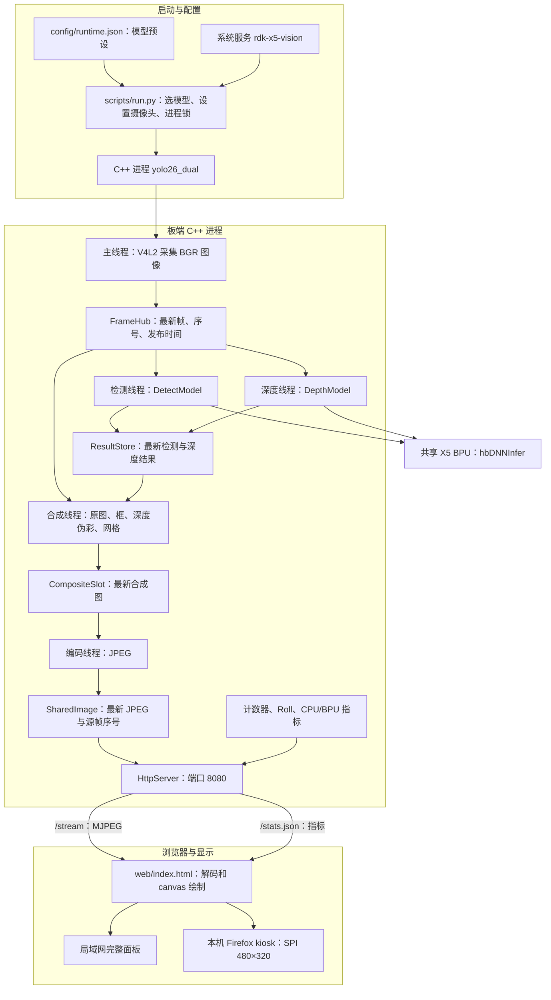
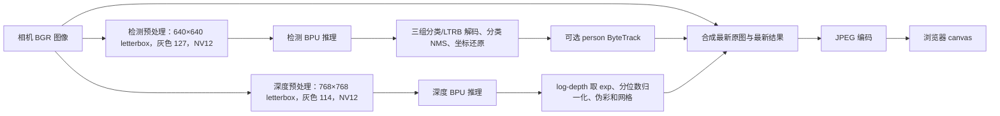
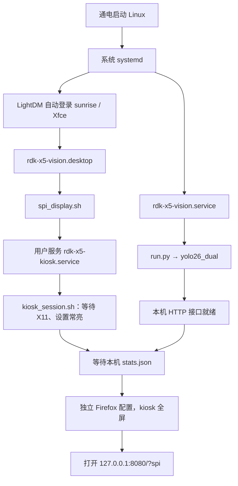

# 代码架构：从摄像头到 SPI 屏

这套工程可以分成三个部分：**Python 启动管理、C++ 图像与推理流水线、浏览器展示**。启动脚本负责选模型和配置设备；C++ 程序持续处理视频；Firefox 从本机 HTTP 服务取图并显示。

先看本页理解设计，再按 [学习与使用路线](learning-guide.md) 跟读代码。以下结构对应仓库根目录的 X5 实现；S100P 原代码在 [references/s100p](../references/s100p/)。

## 1. 整体架构图

图中的两个推理线程共用 X5 BPU 资源。每个线程内部都按“预处理 → 提交推理并等待 → 后处理”顺序执行；两条线程之间可以交叠 CPU 工作和 BPU 调度，并不表示有两颗独立 BPU。

BPU 使用率由 `main.cpp` 的 `bpu_load` 读取 `/sys/devices/system/bpu/ratio`；CPU/内存采样由 `system_metrics::Sampler` 处理。

浏览器不调用模型，也不需要上传图像到云端。这里没有 ROS2/TROS 节点、Flask 后端或前端打包工具；HTTP 服务直接写在 C++ 中，页面是单个 HTML 文件。

## 2. 目录与代码职责

| 目录或入口 | 负责什么 | 阅读时关注 |
|---|---|---|
| [config/runtime.json](../config/runtime.json) | N/N、S/N、S/S 模型组合 | `default_preset` 与模型文件名 |
| [scripts/run.py](../scripts/run.py) | 配置解析、进程锁、V4L2 控件、启动 C++、退出恢复 | `main()`、`on_signal()`、`finally` |
| [cpp/src/main.cpp](../cpp/src/main.cpp) | 推理封装、数据共享、工作线程、HTTP、主循环 | 本页下一节的类和入口 |
| [tracking/byte_tracker.cpp](../cpp/src/tracking/byte_tracker.cpp) | person 多目标跟踪 | Kalman 预测、匹配、轨迹生命周期 |
| [ui/browser_overlay.cpp](../cpp/src/ui/browser_overlay.cpp) | C++ 侧跟踪框与文字绘制 | 输入 `TrackView`，输出到 `cv::Mat` |
| [system_metrics.cpp](../cpp/src/system_metrics.cpp) | 读取并解析 CPU、内存使用率 | `system_metrics::Sampler`、缺失指标处理 |
| [kms_display.h](../cpp/src/kms_display.h) | 可选 HDMI DRM/KMS 输出 | SPI 默认路径无需先读它 |
| [web/index.html](../web/index.html) | 浏览器布局、指标轮询、MJPEG 解码、SPI 重排 | `renderStats()`、`receiveStream()`、`spiMode` |
| [config/](../config/) 与 [启动脚本](../scripts/kiosk_session.sh) | 开机推理、桌面登录、全屏与常亮 | 系统服务和用户服务是两套进程管理 |
| [vendor/rdk_model_zoo](../vendor/rdk_model_zoo/) | 固定版本的官方 Python 对照代码 | 数值验证使用，不是实时推理入口 |
| [references/s100p](../references/s100p/) | S100P 原始代码与文档 | 对照 API 和设计，不在 X5 上执行其部署脚本 |

## 3. main.cpp 的阅读地图

`main.cpp` 集中了大部分功能，适合按符号跳转阅读，不必从头顺读 2000 多行。

| 入口 | 功能 | 输入 → 输出 |
|---|---|---|
| [DnnModel](../cpp/src/main.cpp#L112) | 模型句柄、张量内存、缓存操作和 BPU 调用 | NV12 输入内存 → 模型输出内存 |
| [DetectModel](../cpp/src/main.cpp#L315) | YOLO26 检测前后处理 | BGR → 框、类别、分数 |
| [DepthModel](../cpp/src/main.cpp#L408) | 深度前后处理 | BGR → 深度伪彩图、相对网格 |
| [FrameHub](../cpp/src/main.cpp#L618) | 发布与读取最新相机帧 | 相机图像 → 图像引用、序号、时间 |
| [ResultStore](../cpp/src/main.cpp#L682) | 安全交换最新推理结果 | `DetResult` / `DepResult` |
| [Roll](../cpp/src/main.cpp#L711) | 推理等耗时的滚动统计 | 耗时样本 → 平均、最小、最大、P95 |
| [SharedImage / CompositeSlot](../cpp/src/main.cpp#L747) | 合成、编码、网络间的最新结果交接 | `cv::Mat` → JPEG 字节 |
| [HttpServer](../cpp/src/main.cpp#L1255) | HTTP 页面、指标、图像流 | 请求路径 → HTML / JSON / JPEG |
| [Args / ParseArgs](../cpp/src/main.cpp#L1448) | C++ 参数和边界校验 | 命令行 → 运行配置 |
| [main()](../cpp/src/main.cpp#L1538) | 装配组件、启动线程、采集与清理 | 参数、设备、模型 → 实时服务 |
| [det_worker](../cpp/src/main.cpp#L1762) / [dep_worker](../cpp/src/main.cpp#L1825) | 两路实际推理循环 | 最新帧 → 最新结果 |
| [encoder](../cpp/src/main.cpp#L1859) / [composer](../cpp/src/main.cpp#L1881) | 编码、画框、图像拼接 | 最新图像和结果 → 带标注视频 |
| [build_stats](../cpp/src/main.cpp#L2087) | 组织指标 JSON | 计数器、结果、系统采样 → JSON |
| [采集与退出循环](../cpp/src/main.cpp#L2224) | 从摄像头发布帧、结束后等待线程退出 | V4L2 → FrameHub |

上述链接对应当前源码行号；后续代码调整时，以表中类名和线程变量名搜索定位。

## 4. 一帧图像的处理过程

**预处理**把摄像头图像变成模型规定的输入。Letterbox 是等比例缩放后补边，避免把人和物体拉伸。NV12 用 Y 平面保存亮度、交错 UV 平面保存颜色；X5 模型使用一块连续的 Y+UV 输入内存。代码中的 `y_idx_` / `uv_idx_` 是这块输入的平面视图，不是两个独立的模型输入张量。

**BPU 调用**集中在 `DnnModel::Run()`：CPU 写好输入后执行 cache clean；调用 `hbDNNInfer` 和 `hbDNNWaitTaskDone`；释放任务，再对输出执行 cache invalidate，让 CPU 读取 BPU 写回的数据。该函数记录的 `bpu_ms` 包含提交和等待过程，可能含调度等待，不能据此直接推导硬件占用率。

**检测后处理**将六个输出组织成三个尺度的分类和 LTRB 回归结果，执行阈值筛选、逐类别 NMS，再把坐标从模型输入空间变回相机空间。NMS 用于去除同类重叠候选框。只有启用 `--track` 时才更新 person 轨迹。

**深度后处理**对已校准的 log-depth 取 `exp`，按小尺寸输出图的 2% / 98% 分位数归一化，再生成伪彩。默认 4×3 网格表示 4 列、3 行分区，在交点取值，因此有 **5×4 = 20 个读数**；读数经过 3×3 中值和时域平滑，0 近、1 远。该数值不是米，也不是跨帧固定的绝对尺度。

在默认 640×480 相机输入下，C++ 将检测图和深度图上下拼接，中间分隔带为 4 像素，JPEG 为 640×964。`?spi` 页面再从 JPEG 中截取上下两幅画面，缩放为左右两栏，排进 480×320 屏幕。想改 SPI 左右布局，应改前端 canvas 分支。

## 5. 线程为何使用“最新帧”

`FrameHub`、`ResultStore`、`CompositeSlot` 和 `SharedImage` 都只保存各自最新的状态。慢消费者可能跳过中间帧，系统不会为每个阶段维护一个不断增长的完整视频队列。

| 共享位置 | 写入方 | 读取方 | 内容 |
|---|---|---|---|
| FrameHub | 主线程 | 检测、深度、合成线程 | 最新 BGR 图像、`seq`、发布时刻 |
| ResultStore | 检测与深度线程 | 合成、指标接口等 | 框、轨迹、深度图、源帧序号与时间 |
| CompositeSlot | 合成线程 | JPEG 编码线程 | 最新合成图、版本、相机源帧序号 |
| SharedImage | 编码线程 | 各 HTTP 图像客户端 | JPEG、版本、相机源帧序号 |

互斥锁保护状态交换；条件变量让消费者等待新版本；发布后的图像存储按不再改写的约定供读取者使用。`cv::Mat` 赋值通常是引用计数共享，不等于深拷贝，因此绘制检测框前使用 `frame.clone()`，避免污染其他线程正在读取的相机帧。

例如，合成线程拿到相机第 100 帧时，检测可能只完成到第 99 帧，深度只完成到第 97 帧。它会直接合成最新可用结果，继续输出流畅视频；移动较快的目标可能出现框或深度滞后。**检测源帧、深度源帧、画面源帧没有被强制同步。**

`X-Source-Seq` 标识合成图采用的相机源帧，不代表两项模型都处理了该帧。浏览器解码后统计不同源帧；`age_ms` 表示当前读取指标时，距对应源帧在 `FrameHub` 发布过去的时间，并不是相机曝光到物理面板发光的完整延迟。

## 6. Web 接口与页面逻辑

| 接口 | 内容 | 使用方式 |
|---|---|---|
| `/` | 完整 Web 面板 HTML | 局域网浏览器打开 |
| `/?spi` | 同一 HTML，查询参数选择 SPI 布局 | 本机全屏浏览器 |
| `/stream` | multipart MJPEG | 连续 JPEG，带 `Content-Length` 和 `X-Source-Seq` |
| `/snapshot.jpg` | 最新合成 JPEG | 截图或连接检查；还没有图像时返回 503 |
| `/stats.json` | 相机/算法/编码、模型、CPU/BPU 等 JSON | 指标面板和测量脚本 |
| `/qr/qr1.png` 等 | 本地二维码图片 | 参考资料入口 |
| `/stop` | 使当前 C++ 进程结束 | 是有副作用的接口；常驻模式随后会自动重启 |

`pollStats()` 定期请求 JSON，`renderStats()` 更新文字和进度条；`receiveStream()` 按 multipart 长度拆出 JPEG，使用 `createImageBitmap()` 解码，再画入 canvas。断流后自动重连。

服务没有用户认证，适合受控局域网展示。维护时要保持停止，请用 `systemctl stop rdk-x5-vision`，不要用 `/stop` 来代替服务管理。

## 7. 开机到全屏的启动图

推理与桌面启动是两条可以并行的路径，浏览器等本机服务可访问后再打开页面。两个服务都配置了 `Restart=always`，进程退出后等待 3 秒再尝试启动；实际恢复还包括模型和浏览器初始化。人为执行 `systemctl stop` 会保持停止。

如果浏览器故障，推理进程可以继续工作；如果推理进程重启，浏览器会重连图像流。具体维护命令见 [展会文档](exhibition.md)。

## 8. 阅读时需要识别的上游遗留部分

当前代码仍保留部分 S100P 时代的字段、分支和注释，阅读时以正在执行的逻辑为准：

- `DepthModel` 将 `profile_` 固定为 `nv12`，保留的 `lite` 分支不表示当前 X5 已支持 lite 模型。
- `DnnModel::Run(int priority, uint64_t)` 的第二个参数未使用；`--bpu-core` 只允许 0，不能据此选择多颗 BPU。
- 某些注释仍写着双输入 Y/UV 或 1080p；实际输入是一块 NV12，默认摄像头配置为 640×480。
- `--depth-meters` 虽仍被解析，但非零值会被主函数拒绝。
- 直接运行 C++ 二进制、不指定模型时，默认回退到 N/N；通过 `run.py` 或服务启动时按 JSON 预设，默认是 S/S。
- HTML 内的 `detectHbmMs` 等名称是历史命名，不表示 X5 在加载 S100P HBM；实际模型以 `/stats.json` 中的文件名为准。

这些边界也解释了为什么新增模型不能只改文件扩展名；必须同时核对 BPU 平台、输入布局、输出顺序、shape 和解码方法。平台对照见 [X5 / S100P 差异](x5-vs-s100p.md)。
