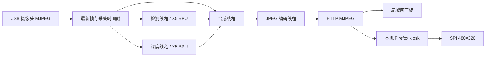

# 数据流和帧率

- 相机帧带递增序号和采集时间戳；工作线程读取最新帧，避免无界队列。
- 检测、深度结果可以来自不同帧，界面显示各自更新速度及源帧年龄。
- 合成按不同相机帧触发；`composed_frames` 与 `encoded_frames` 分开统计。
- MJPEG 每帧携带 `X-Source-Seq`，浏览器在 JPEG 解码并绘制 canvas 后统计不同源帧，避免用定时器重复绘图冒充相机帧率。
- 网络断流自动重连。浏览器绘制帧率只是软件端指标，SPI 的传输带宽另行限制物理刷新。

深度网格是帧内归一化的相对值：0 近、1 远，经过 3×3 中值与时域平滑。不同帧的归一化尺度可能变化，不能用于公制距离测量或直接比较跨帧绝对距离。
