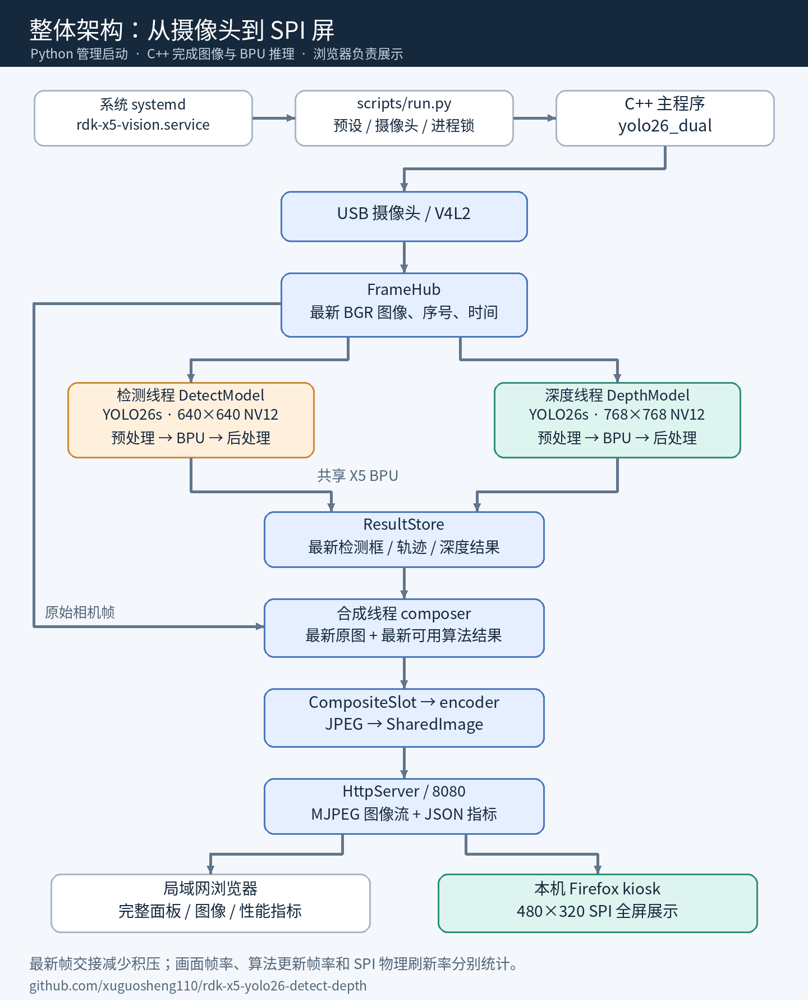
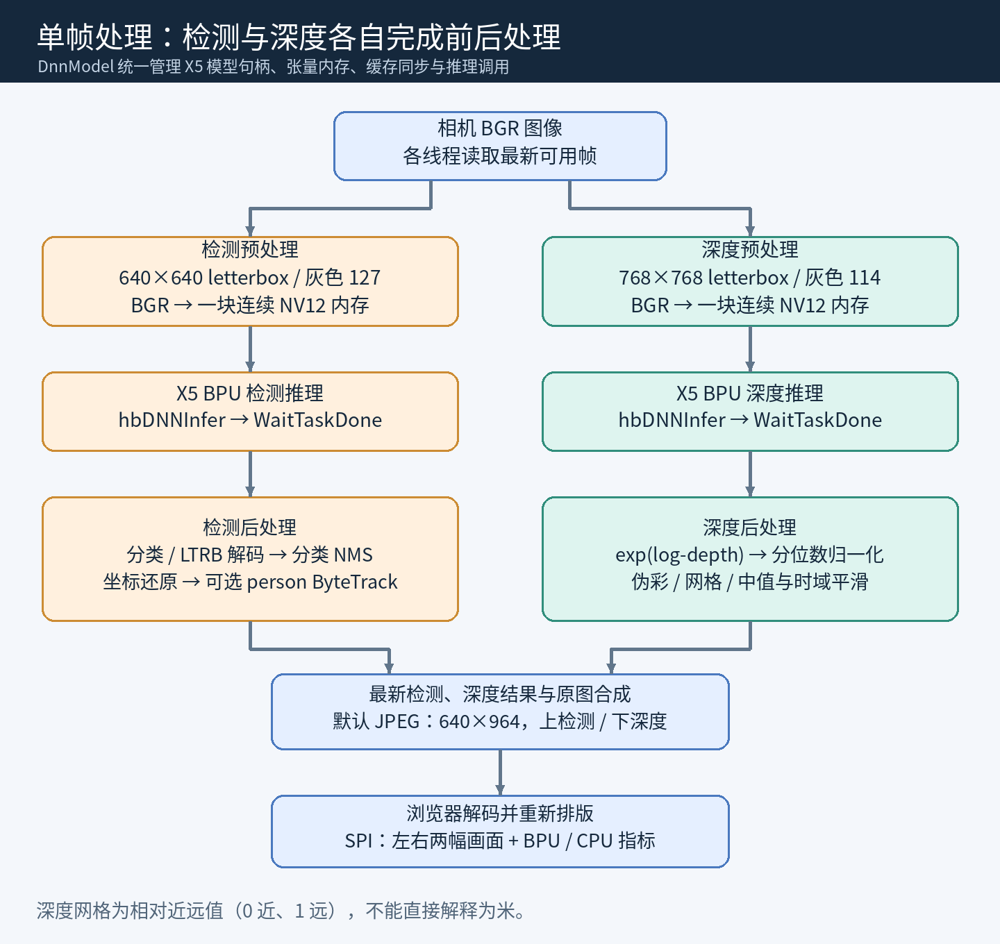
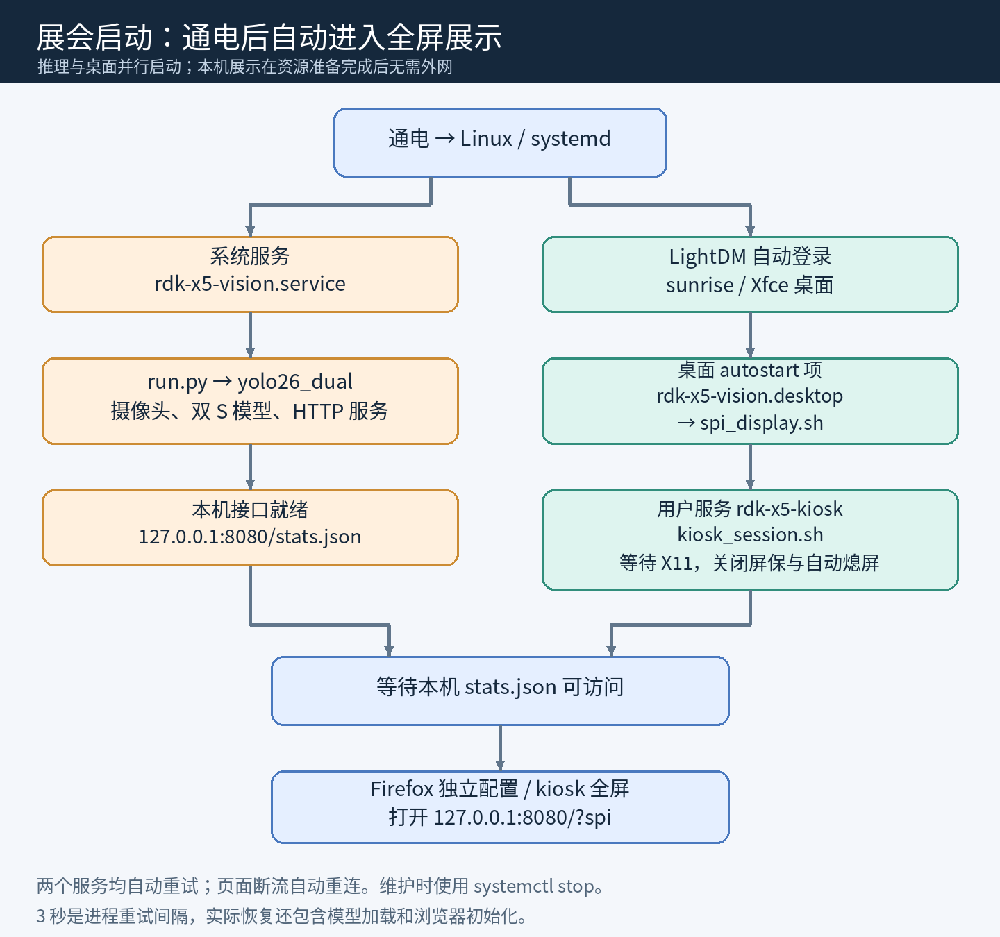

# 【开源分享】【RDK X5】YOLO26 检测 + 单目深度：代码架构、SPI 全屏与展会自启动

大家好，这次把社区里的 **S100P 双模型演示方案移植到了 RDK X5**，并整理成一套适合学习、二次开发和展会通电展示的开源工程。

当前默认使用 **YOLO26s 检测 + YOLO26s 深度**，通过 X5 BPU 运行，USB 摄像头采集，浏览器展示检测框、深度伪彩和系统指标。已经在 480×320 SPI 屏上完成全屏显示、开机自动登录、自动运行和进程退出恢复验证。

**项目源码：[xuguosheng110/rdk-x5-yolo26-detect-depth](https://github.com/xuguosheng110/rdk-x5-yolo26-detect-depth)**

先感谢 [Max.Ma 的 S100P 原始案例](https://forum.d-robotics.cc/t/topic/35680)和[上游开源项目](https://github.com/maxma615/yolo26-detect-depth-demo)。本仓库保留了带 MIT 许可证的 S100P 固定版本源码，模型和前后处理参考 [D-Robotics 官方 X5 Model Zoo](https://github.com/D-Robotics/rdk_model_zoo/tree/rdk_x5)。本文重点分享 X5 实现的代码结构、移植差异和使用方法。

## 一、先看整体架构



整套程序分为三部分：

| 部分 | 代码入口 | 职责 |
|---|---|---|
| Python 启动管理 | `scripts/run.py` | 读取模型预设、配置摄像头、加进程锁、启动 C++，正常退出时恢复摄像头设置 |
| C++ 图像与推理 | `cpp/src/main.cpp` | 采集、检测、深度、合成、JPEG 编码、HTTP 服务 |
| 浏览器展示 | `web/index.html` | 解析 MJPEG、绘制 canvas、轮询指标、SPI 左右布局 |

实时推理是 **C++ + libdnn**。Python 不在逐帧推理循环中，浏览器也不调用模型；模型运行在板端，展示不依赖云端服务。

在 C++ 内部，主线程负责摄像头采集，检测、深度、合成和 JPEG 编码分别使用工作线程。两个模型共享 X5 BPU，各线程内部仍按“预处理 → 推理并等待 → 后处理”的顺序执行。

## 二、结合代码理解一帧图像



### 1. 从摄像头到模型

相机采集得到 BGR 图像，通过 `FrameHub` 发布最新帧、递增序号和发布时间。

- 检测：等比例缩放、灰色 127 补边到 640×640，转换为 NV12。
- 深度：等比例缩放、灰色 114 补边到 768×768，转换为 NV12。
- X5 模型使用 **一块连续的 Y+UV 输入内存**。代码里的 Y/UV 平面视图不能理解为两个独立输入张量。

两个模型共用 `DnnModel` 的底层封装：分配张量内存 → 输入 cache clean → `hbDNNInfer` → `hbDNNWaitTaskDone` → 释放任务 → 输出 cache invalidate。

### 2. 两条工作线程怎么写

检测线程的关键代码结构如下，省略了跟踪与统计部分，完整实现见 [det_worker 源码](https://github.com/xuguosheng110/rdk-x5-yolo26-detect-depth/blob/9514827bfc21e66d8110eca2e498080e0a528952/cpp/src/main.cpp#L1762)：

```cpp
// 读取比上次更新的相机帧，允许跳过已经过时的帧
if (!hub.latest(seq, frame, 1.0, &captured)) continue;

DetResult r;
r.source_seq = seq;
r.captured = captured;
r.pre_ms = det.Preprocess(frame);
r.bpu_ms = det.Infer(args.prio_det, backend);
std::vector<tracking::SourceDetection> source_dets;
r.post_ms = det.Postprocess(
    frame.cols, frame.rows,
    (args.tracking ? std::min(args.score, args.track_low_thresh) : args.score),
    args.score, args.nms, r.dets, source_dets, r.cls_hist);
// 此处省略可选 person ByteTrack 和统计逻辑
store.set_det(r);
```

这段代码展示了“最新帧 → 预处理 → 推理 → 后处理 → 发布结果”的主线。深度线程采用相同组织方式，结果写到 `ResultStore` 的深度槽。

检测输出经过分类/LTRB 解码、逐类别 NMS 和坐标还原；深度输出对已校准 log-depth 取 `exp`，经分位数归一化生成伪彩与网格。默认 4×3 网格有 5×4 个交点，共 **20 个相对读数**，0 近、1 远，不能直接当作米。

### 3. 为什么视频帧率可以高于算法更新速度

`FrameHub`、`ResultStore`、`CompositeSlot` 和 `SharedImage` 都保存最新状态，没有为每个消费者累积完整视频队列。

例如合成线程已拿到相机第 100 帧，检测可能完成到第 99 帧，深度可能完成到第 97 帧。程序会使用最新可用结果继续显示，因此视频能保持连续，但快速运动时框或深度可能滞后。这是一项明确的延迟与算法更新速度取舍，并非每帧都同步执行完两项模型。

C++ 将原图与检测框、深度伪彩上下拼接，再交给独立线程编码 JPEG。浏览器 `?spi` 分支从合成 JPEG 中取出两幅图，缩放为左右两栏。图像流里的 `X-Source-Seq` 用来统计不同相机源帧，避免用重复绘制冒充视频出帧。

## 三、X5 和 S100P 哪些地方不能直接照搬

| 项目 | S100P 参考实现 | 本项目 X5 实现 |
|---|---|---|
| BPU 模型平台 | Nash | Bayes-e |
| 模型文件 | HBM | 官方 X5 NV12 BIN |
| 推理与调度 | hbDNNInferV2 / hbUCP | hbDNNInfer / hbDNNWaitTaskDone |
| 内存与缓存 | hbUCP 相关接口 | hbSysAllocCachedMem / hbSysFlushMem |
| NV12 输入 | 参考路径使用分离 Y/UV | 一块连续 Y+UV，sysMem[0] |
| 显示重点 | Web + HDMI/KMS | Web + SPI Firefox kiosk |
| 模型选择 | 原案例的大模型配置 | N/N、S/N、S/S 三档；默认双 S |
| 深度单位 | 上游有尺度系数选项 | 当前只显示相对近远，拒绝非零 `--depth-meters` |

模型不能只改扩展名就使用。当前 X5 实现要求匹配的输入布局和连续 float32 输出；更换模型必须同时检查 shape、输出顺序、量化形式及解码方式。完整说明见 [X5 / S100P 移植差异](https://github.com/xuguosheng110/rdk-x5-yolo26-detect-depth/blob/main/docs/x5-vs-s100p.md)。

## 四、X5 实测：分别看视频、算法和屏幕

测试环境：RDK X5 V1.0、RDK OS 3.5.0 / Ubuntu 22.04、内核 6.1.83、DNN 1.24.5 / HBRT 3.15.55，BPU 约 996MHz；USB 摄像头 640×480 MJPEG、临时手动 10ms 曝光，ByteTrack 关闭，SPI Firefox 展示运行。

| 检测 / 深度 | BPU 平均占用 | 检测更新 | 深度更新 | 视频编码 |
|---|---:|---:|---:|---:|
| YOLO26n / YOLO26n | 约 70% | 约 29.5fps | 约 19.5fps | 约 29.6fps |
| YOLO26s / YOLO26n | 约 82% | 约 22.3fps | 约 18.7fps | 约 29.6fps |
| YOLO26s / YOLO26s | 83.5% | 18.30fps | 14.55fps | 29.58fps |

双 S 的最终稳定测量窗口为 64.2 秒，BPU P95 为 91%，有个别 100% 峰值。这些是该设备与场景下的观测结果，不是所有摄像头、散热和场景的最低性能保证。[测量与验证摘要](https://github.com/xuguosheng110/rdk-x5-yolo26-detect-depth/blob/main/docs/validation.md)。

**这里的约 29.6fps 是软件视频输出，不是 SPI 屏物理刷新率。** 当前屏幕为 480×320 RGB565、40MHz SPI，全帧传输理论上限为：

```text
40,000,000 / (480 × 320 × 16) ≈ 16.3 帧/秒
```

实际还要扣除命令传输和驱动开销，因此不能宣称当前 SPI 屏达到了物理全画面 30fps。HDMI 代码路径保留且可编译，但本次没有接 HDMI 屏进行验收。

另已完成 CTest 3/3，以及官方 bus.jpg 单图数值对照：高置信检测匹配 IoU 均大于 0.99999，深度 log 输出余弦相似度约 0.999875。这是实现一致性验证，不等同于数据集精度评估。

## 五、展会模式：通电自动登录、推理和全屏



启动分两条路径：系统服务启动推理；LightDM 自动登录 sunrise / Xfce，桌面启动项拉起用户级 kiosk 服务。浏览器脚本等待 X11 和本机 `/stats.json` 就绪后，再用独立 Firefox 配置全屏打开：

```text
http://127.0.0.1:8080/?spi
```

展会模式关闭屏保与自动熄屏；模型和软件准备好后，展示不依赖外网。推理和浏览器均配置退出后自动重试，页面断流则自行重连。

已经做过实际重启与恢复测试：

- 重启后无需手动操作，自动进入 480×320 全屏双模型展示。
- 浏览器主进程 SIGKILL 后，约 16.2 秒恢复全屏。
- 推理主进程 SIGTERM 后，约 10.4 秒恢复且已采集超过 60 帧。

3 秒是服务的重试间隔，实际恢复还需要模型加载与浏览器初始化。维护时使用 `systemctl stop` 保持停止，单纯关闭浏览器窗口会被自动拉起。

## 六、部署和学习入口

**前置条件：**X5 上已有对应 SPI 驱动、面板固件、背光、X11 桌面、LightDM/Xfce 和 Firefox；当前脚本默认 `sunrise` 用户、UID 1000、DISPLAY `:0`。安装脚本不安装 SPI 内核驱动，也不覆盖设备树，其他系统配置需要先适配。[SPI 前置条件](https://github.com/xuguosheng110/rdk-x5-yolo26-detect-depth/blob/main/docs/spi-display.md)。

在 X5 上以 root 执行；以下用于首次部署到尚不存在的工程目录：

```bash
apt-get update
apt-get install -y git
mkdir -p /app
git clone https://github.com/xuguosheng110/rdk-x5-yolo26-detect-depth.git /app/rdk-x5-vision
cd /app/rdk-x5-vision
bash scripts/install.sh
```

安装过程会下载并 SHA256 校验四个官方模型、构建、执行测试，然后配置推理和桌面自启动。它会设置桌面自动登录和屏幕常亮，同名配置安装前会备份。

调试时可以临时切换组合，结束后恢复常驻服务：

```bash
cd /app/rdk-x5-vision
systemctl stop rdk-x5-vision
bash scripts/run.sh --preset balanced --max-seconds 20
systemctl start rdk-x5-vision
```

模型组合由 `config/runtime.json` 管理。已有服务若有显式模型参数的覆盖项，应先用 `systemctl cat rdk-x5-vision` 查看最终启动命令。其他摄像头不支持默认曝光控件时，可尝试 `--keep-camera-settings` 并复测帧率与图像效果。

局域网面板为 `http://<X5_IP>:8080/`，指标为 `/stats.json`。这是无用户认证的局域网演示服务，不应直接暴露到公网。

| 想学习或修改什么 | 从哪里开始 |
|---|---|
| 模型预设、摄像头和进程管理 | `config/runtime.json`、`scripts/run.py` |
| BPU 模型与内存调用 | `main.cpp` 的 `DnnModel` |
| 检测和深度前后处理 | `DetectModel`、`DepthModel` |
| 多线程最新帧交换 | `FrameHub`、`ResultStore`、`CompositeSlot`、`SharedImage` |
| 检测框和 HUD | `DrawYoloBox()`、`DrawHud()`、`browser_overlay.cpp` |
| SPI 标题和左右布局 | `web/index.html` 的 `spiMode` canvas 分支 |
| 开机全屏与异常恢复 | `config/`、`setup_exhibition.sh`、`kiosk_session.sh` |

推荐阅读顺序：**模型预设 → run.py → main() → FrameHub 与工作线程 → 模型前后处理 → Web 展示**。仓库已提供带具体源码位置的[架构讲解](https://github.com/xuguosheng110/rdk-x5-yolo26-detect-depth/blob/main/docs/architecture.md)和[学习与修改指南](https://github.com/xuguosheng110/rdk-x5-yolo26-detect-depth/blob/main/docs/learning-guide.md)。

## 七、源码和参考资料

- [X5 项目仓库](https://github.com/xuguosheng110/rdk-x5-yolo26-detect-depth)
- [S100P 参考源码快照与固定版本说明](https://github.com/xuguosheng110/rdk-x5-yolo26-detect-depth/tree/main/references)
- [官方 X5 模型与推理示例](https://github.com/D-Robotics/rdk_model_zoo/tree/rdk_x5)
- [展会部署与维护文档](https://github.com/xuguosheng110/rdk-x5-yolo26-detect-depth/blob/main/docs/exhibition.md)

应用派生代码保留上游 MIT 许可证，官方 Python 对照实现保留 Apache-2.0 许可证；模型权重不打包进 Git，其许可随原提供方。欢迎交流其他摄像头和显示接口上的适配结果，也欢迎结合源码讨论 CPU 前后处理、延迟与显示刷新方面的改进。
