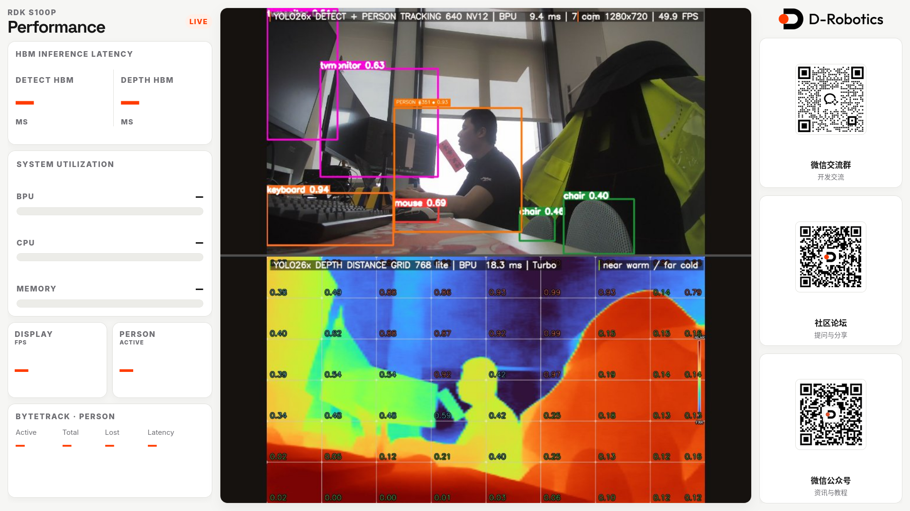
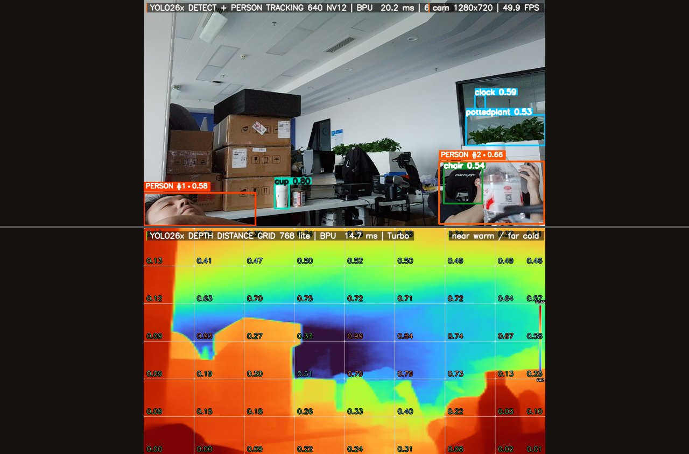

# YOLO26 检测 + 深度 双模型实时演示（RDK S100P）

**[English](README.md)** | **[中文文档](README_cn.md)**

在 **D-Robotics RDK S100P**（Nash）上，**YOLO26 目标检测** 与 **YOLO26 单目深度估计**
在单核 **BPU** 上**并发**推理，融合为一路合成画面，通过 **HTTP/MJPEG**（浏览器）与
**HDMI**（DRM/KMS 直出）输出。

- **检测**：YOLO26 (n/m/x) `640x640 NV12`，anchor-free；person 用原生 C++ **ByteTrack** 跟踪。
- **深度**：YOLO26-Depth (n/l/x) `768x768`，turbo 伪彩 + 可选**距离网格**（相对距离，或
  `--depth-meters` 标定米）。
- **推理**：`hobot_dnn` C API（`hbDNN`/`hbUCP`），双 worker 线程提交异步 UCP 任务，
  两模型同时驻留 BPU 调度器；一模型的 CPU 前/后处理与另一模型的 BPU 执行重叠。
- **显示**：HTTP `:8080`（MJPEG + JSON 面板）；`--hdmi` 走 DRM/KMS 直出（vsync 翻页）。

## 效果截图

**Web 面板**（浏览器 `:8080`）—— 指标面板 + 实时检测/深度 + 二维码：



**合成输出** —— 上：相机 + 检测框 + person 跟踪；下：深度伪彩 + 距离网格：



## 性能（S100P，BPU@1.5GHz，1080p@30 稳态）

| 指标 | 数值 |
|---|---|
| 相机/检测/深度帧 | 1:1 零丢帧 |
| 端到端 | ~29.5 fps |
| 检测 BPU | avg ~9.2ms (p95 ~9.4) |
| 深度 BPU | avg ~15.8ms (p95 ~16.4) |
| BPU 占用 | ~65% |
| 显示流 | ~50 fps |

1080p@30 性能基本相同（合成下采样、模型输入固定），1080p 几乎无额外 BPU 代价。

## 快速开始

```bash
# 1. 取模型（不进 git，见 scripts/download_models.sh）
MODEL_SRC=/userdata/yolo26_dual_demo/models ./scripts/download_models.sh

# 2. 部署 + 板端编译
BOARD=root@192.168.3.191 ./scripts/deploy.sh

# 3. 运行
bash scripts/run.sh                          # 相机 + web :8080
bash scripts/run.sh --source 2 --cam-fps 60  # 选相机/帧率（PIXY 支持 60）
bash scripts/run.sh --hdmi                   # HDMI 直出
```

浏览器打开 `http://<板ip>:8080/`。

## 目录

```
cpp/            CMake + main.cpp + kms_display.h + tracking(ByteTrack) + ui + tests
web/index.html  浏览器面板（服务端每次请求重读，改完刷新即生效）
assets/         COCO 标签
scripts/        run/deploy/download_models/install_boot/uninstall_boot/pixy_tracking
docs/           architecture / web-ui / hdmi / camera-pixy / packaging
```

## 相机：EMEET PIXY + AI 跟踪

任意数字 `--source` 都按 V4L2 相机处理。EMEET PIXY 支持固件级 AI 人形跟踪：

```bash
sudo pip3 install hidapi
sudo python3 scripts/pixy_tracking.py on   # 相机自动跟人
```

详见 [docs/camera-pixy.md](docs/camera-pixy.md)。

## 打包 .deb

```bash
cd cpp/build && cpack -G DEB && sudo dpkg -i yolo26-detect-depth-demo_*.deb
```

详见 [docs/packaging.md](docs/packaging.md)。

## 测试

```bash
cd cpp/build && ctest --output-on-failure
```

## 许可证

MIT，见 [LICENSE](LICENSE)。
